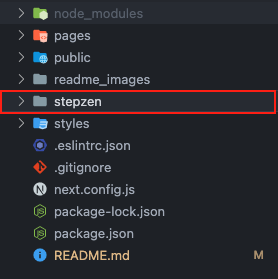

## Creating a new project

---

To create a new project, run the following command for a guided project creation:

```bash
npx create-next-app
```

**Note:** This will create a project with JavaScript and without Tailwind css.

To create a project using Tailwind CSS and TypeScript run the following command instead of the above command:

```bash
npx create-next-app -e with-tailwindcss --ts project-name
```

## Configuring Supabase

---

[Supabase](https://supabase.com/) is a postgres database.

#### Steps for configuration

> 1. Sign in using a github account or create a new account on Supabase.
> 2. Create a new project (You can use the same name as you project name).
>    - You might not have an organization created already.
>    - Create an organization, name it as per you choice.
> 3. You can create maximum 2 projects on free tier in supabase.
> 4. Create a project using the new organization name you created earlier.
> 5. Remember the database password that you gave while creating the project. we need it while configuring GraphQL

## Configuring Stepzen (GraphQL Server)

---

[Stepzen](https://stepzen.com/why-stepzen) is a GrapgQL server, meant to speed up API development with less code.

#### Steps for configuration

> 1. Sign in using a github account or create a new account on Stepzen.
> 2. Navigate to the Authentication page on stepzen console (Keep the credentials secret).
> 3. Open the [Stepzen installation guide](https://stepzen.com/docs/quick-start/install-and-setup).
> 4. Install stepzen CLI to your system, run: `npm install -g stepzen`
> 5. After installation, run: `stepzen login`
> 6. Follow the prompts and pass the associated keys from the stepzen authentication page.

## Adding Stepzen to the project

---

#### Follow the steps to add stepzen into your project

> 1. Manually create a stepzen folder inside you project's root directory.
>    
> 2. Change the terminal directory to the newly created stepzen folder, run: `cd stepzen`
> 3. Initialize stepzen inside the folder by running: `stepzen init`
> 4. Follow along the prompts after running `Stepzen init`.
>
>    **Note:** You can keep the endpoint name as suggested by stepzen.

<!-- # Next.js + Tailwind CSS Example

This example shows how to use [Tailwind CSS](https://tailwindcss.com/) [(v3.0)](https://tailwindcss.com/blog/tailwindcss-v3) with Next.js. It follows the steps outlined in the official [Tailwind docs](https://tailwindcss.com/docs/guides/nextjs).

## Deploy your own

Deploy the example using [Vercel](https://vercel.com?utm_source=github&utm_medium=readme&utm_campaign=next-example) or preview live with [StackBlitz](https://stackblitz.com/github/vercel/next.js/tree/canary/examples/with-tailwindcss)

[](https://vercel.com/new/git/external?repository-url=https://github.com/vercel/next.js/tree/canary/examples/with-tailwindcss&project-name=with-tailwindcss&repository-name=with-tailwindcss)

## How to use

Execute [`create-next-app`](https://github.com/vercel/next.js/tree/canary/packages/create-next-app) with [npm](https://docs.npmjs.com/cli/init), [Yarn](https://yarnpkg.com/lang/en/docs/cli/create/), or [pnpm](https://pnpm.io) to bootstrap the example:

```bash
npx create-next-app --example with-tailwindcss with-tailwindcss-app
```

```bash
yarn create next-app --example with-tailwindcss with-tailwindcss-app
```

```bash
pnpm create next-app --example with-tailwindcss with-tailwindcss-app
```

Deploy it to the cloud with [Vercel](https://vercel.com/new?utm_source=github&utm_medium=readme&utm_campaign=next-example) ([Documentation](https://nextjs.org/docs/deployment)). -->
